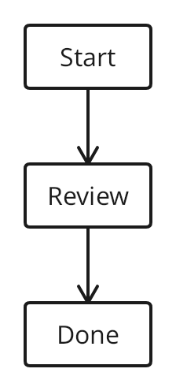

# TextGraph for Markdown Preview

Render `textgraph` fenced code blocks as diagrams in VS Code’s built-in Markdown preview. Diagrams update automatically as you edit, including unsaved changes. Multiple diagrams, ordinary Markdown, and inline errors work together.

````markdown
# A small workflow

```textgraph
Start -> Review -> Done
```
````

Open a Markdown file, then run **Markdown: Open Preview to the Side** (`Ctrl+K V`, or `Cmd+K V` on macOS). The first diagram takes a few seconds to initialize.



## Requirements

- VS Code **1.101.0 or newer**, desktop or a Node-based remote Extension Host. VS Code 1.101 introduced Node 22 in both desktop and remote hosts. A browser-only host such as vscode.dev without a remote host is unsupported.
- A **trusted workspace** to render. Restricted Mode displays escaped source with a trust notice and does not start the renderer.

Independent of the DrawMotive drawing editor. Uses public `@drawmotive/textgraph@0.1.0-alpha.1`, bundled with its runtime and fonts. Rendering is local; no service, API key, separate npm installation, or private C#/WASM build is needed.

## Errors and limits

SDK syntax diagnostics appear beside the source. Editing triggers a new render. The alpha SDK can hang on `A -> {}` and `A -> {{x}}`. The extension does not rewrite or special-case syntax: each render has a 15-second deadline and the Worker is terminated on timeout. Other diagrams continue in a fresh Worker. A timeout is an operational error, not a syntax diagnosis.

Each diagram is limited to 64 KiB of source and a maximum width of 2048 pixels. Complex diagrams may hit the deadline. Bundled SDK fonts determine available glyphs; custom font packs are not yet configurable.

## Security and lifecycle

The preview receives PNG data URIs and escaped diagnostic text. No preview JavaScript, browser Worker, external server, or CSP relaxation is needed. Workspace source is SDK input; never executable JavaScript.

Changed or removed diagrams cancel obsolete work. Closing a document releases its cache. The Worker shuts down after ten idle seconds; inactive caches expire after five minutes because the Markdown extension has no public preview-close event. Deactivation terminates outstanding work.

## Install a VSIX

Run **Extensions: Install from VSIX…** and select `textgraph-markdown-0.1.0.vsix`, or:

```sh
code --install-extension textgraph-markdown-0.1.0.vsix
```

## Development

From this repository’s independent `vscode` npm package:

```sh
npm ci --workspaces=false
npm test
npm run package
npm run test:host
```

The host test downloads VS Code 1.101.0, installs the actual VSIX into isolated profiles, and tests built-in Markdown Preview through the real Extension Host and webview. Linux CI uses `xvfb-run -a npm run test:host`; a desktop display also works. Set `VSCODE_VERSION=stable` for the current stable host. No C# project is built.

See [release instructions](https://github.com/drawmotive/markdown-textgraph/blob/main/vscode/RELEASE.md) and [the SDK](https://github.com/drawmotive/textgraph).
